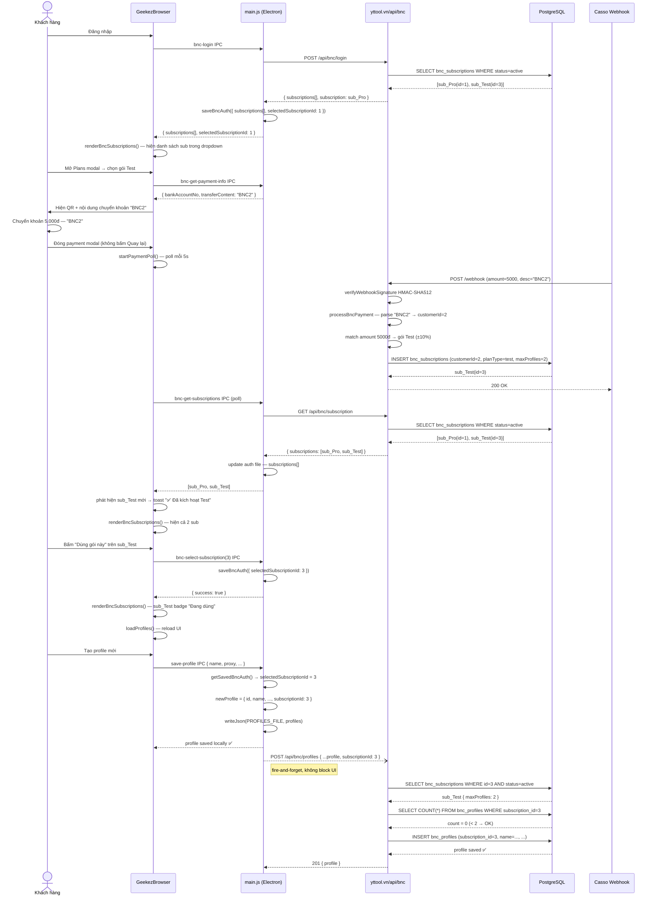

# BNC — Luồng E2E: Mua Gói → Quản lý Profile

> Cập nhật: 2026-05-13

---

## 1. Cấu hình gói (Plan Catalogue)

Nguồn duy nhất: `server/config/bncPlans.js`

| Gói     | Giá/tháng  | Max Profiles | Max Thiết bị | Loại             |
|---------|------------|--------------|--------------|------------------|
| Starter | 199.000đ   | 30           | **1**        | Single-device    |
| Pro     | 399.000đ   | 100          | **1**        | Single-device    |
| Team    | 699.000đ   | 300          | **3**        | Multi-device     |
| Scale   | 1.299.000đ | 1000         | **5**        | Multi-device     |
| Test    | 5.000đ     | 2            | **2**        | Dev/test only    |

**Multi-device hoạt động như thế nào:**
- Server tính `maxDevices = max(maxDevices)` trên **tất cả** sub active của account
- Ví dụ: user có Pro (1 thiết bị) + Team (3 thiết bị) → được dùng tối đa **3** thiết bị đồng thời
- Thiết bị đăng nhập quá giới hạn → thiết bị cũ nhất (trừ thiết bị vừa login) bị kick

---

## 2. Luồng Đăng nhập

```
GeekezBrowser → POST /api/bnc/login
              ← { accessToken, customer, subscription (newest), subscriptions[] }

main.js: saveBncAuth({
    accessToken,
    email,
    customerId,
    subscriptions[],          // tất cả sub active
    selectedSubscriptionId,   // auto = subscriptions[0].id
})
```

- `subscriptions[]` được cache local trong `bnc_auth.json`
- `selectedSubscriptionId` = sub đầu tiên (endDate DESC) — user có thể đổi thủ công

---

## 3. Luồng Mua Gói (Chuyển khoản)

```
1. User mở Plans modal → chọn gói → xem QR thanh toán
2. Nội dung chuyển khoản: "BNC{customerId}" (ví dụ: BNC2)
3. Số tiền = price của gói (ví dụ 5.000đ cho Test)
4. User chuyển khoản → đóng payment modal

5. App tự động poll server mỗi 5 giây (tối đa 3 phút):
   GET /api/bnc/subscription → kiểm tra sub mới xuất hiện chưa

6. Casso nhận giao dịch → gọi webhook → yttool.vn/webhook
7. Server xác thực HMAC-SHA512 → processBncPayment():
   - Parse "BNC2" → customerId = 2
   - So khớp amount với plan (±10%) → tìm gói phù hợp
   - months = round(amount / plan.price), tối thiểu 1
   - Nếu match → INSERT bnc_subscriptions (status=active)
   - Nếu không match → gia hạn 30 ngày fallback gói hiện tại

8. Poll phát hiện sub mới → toast "✅ Đã kích hoạt gói X"
   - _bncAuth.subscriptions[] được cập nhật
   - renderBncSubscriptions() — hiện sub mới trong dropdown
   - loadProfiles() reload
```

**Lưu ý:** Sub cũ KHÔNG bị cancel khi mua gói mới → nhiều sub active song song.

---

## 4. Luồng Chọn Sub Để Dùng

```
User mở dropdown avatar → thấy danh sách sub active
→ Bấm "Dùng gói này" trên sub muốn dùng
→ renderer: selectBncSubscription(subscriptionId)
→ IPC: bnc-select-subscription
→ main.js: saveBncAuth({ ...auth, selectedSubscriptionId })
→ loadProfiles() reload
```

- `selectedSubscriptionId` chỉ lưu **local** trên từng máy
- Các máy khác có thể đang dùng sub khác nhau của cùng account
- Badge "Đang dùng" trong Plans modal dựa trên selectedSubscriptionId

---

## 5. Luồng Tạo Profile

```
User tạo profile mới
→ save-profile IPC
→ main.js:
    auth = getSavedBncAuth()
    newProfile = {
        id: uuidv4(),
        name, proxy, fingerprint, ...
        subscriptionId: auth.selectedSubscriptionId  // gắn sub đang dùng
    }
    writeJson(PROFILES_FILE)   // lưu local ngay lập tức

→ bncApiCall('POST', '/profiles', newProfile)  // fire-and-forget sync
→ Server createProfile():
    1. Validate subscriptionId thuộc customer + status=active
    2. COUNT profiles WHERE subscription_id = X
    3. Nếu count >= sub.maxProfiles → 400 lỗi
    4. INSERT bnc_profiles (subscription_id = X)
```

**Fire-and-forget:** Profile lưu local trước, sync server sau → UI không bị block. Nếu sync fail (mạng, lỗi), profile vẫn tồn tại local nhưng mất trên server.

---

## 6. Luồng Đồng bộ Profile (Manual)

```
Bấm "🔄 Đồng bộ Profile" trong dropdown
→ IPC: bnc-sync-profiles
→ main.js:
    GET /api/bnc/profiles  (trả tất cả profiles của account)
    
    Nếu server có profiles:
        writeJson(PROFILES_FILE, serverProfiles)  // server là source of truth
        → loadProfiles() reload UI
    
    Nếu server không có:
        POST /api/bnc/profiles/bulk { profiles: localProfiles }  // upload local lên
```

Console log hiển thị từng profile với `subscriptionId` để debug.

---

## 7. Luồng Sync tự động khi Login

```
bnc-login IPC thành công:
    serverProfiles = result.profiles  // server trả tất cả profiles của account

    Nếu serverProfiles.length > 0:
        writeJson(PROFILES_FILE, serverProfiles)  // dùng server làm master

    Nếu serverProfiles.length === 0:
        localProfiles = readJson(PROFILES_FILE)
        POST /profiles/bulk { profiles: localProfiles }  // upload local lên server
```

---

## 8. Multi-device Session Management

```
Login:
    BncSession.upsert({ customerId, deviceId, deviceName, platform })
    allSessions = findAll ORDER BY last_seen_at ASC
    maxDevices = max(maxDevices across all active subscriptions)
    
    Nếu allSessions.length > maxDevices:
        kick = sessions[0..N] (cũ nhất, trừ thiết bị vừa login)
        BncSession.destroy(kick)

Heartbeat (định kỳ):
    GET /api/bnc/subscription
    → 401 reason=other_device/device_kicked → hiện overlay "Đăng nhập máy khác"
    → subscription.isExpired → hiện overlay hết hạn
```

---

## 9. Database Schema (liên quan)

```sql
bnc_subscriptions
  id            INTEGER PK AUTOINCREMENT
  customer_id   INTEGER FK → customers.id
  plan_type     ENUM('test','starter','pro','team','scale')
  max_profiles  INTEGER
  max_devices   INTEGER
  start_date    TIMESTAMP
  end_date      TIMESTAMP
  status        ENUM('active','expired','cancelled')
  price         INTEGER   -- VND tại thời điểm mua
  note          VARCHAR

bnc_profiles
  id                UUID PK  -- do client tạo
  customer_id       INTEGER FK → customers.id
  subscription_id   INTEGER FK → bnc_subscriptions.id  (nullable — legacy)
  name              VARCHAR
  proxy_str         VARCHAR
  fingerprint       JSONB
  group_id          UUID
  is_setup          BOOLEAN
  subscription_id   INTEGER  -- gắn profile với sub

bnc_sessions
  customer_id   INTEGER FK
  device_id     VARCHAR(100)
  device_name   VARCHAR
  platform      VARCHAR
  last_seen_at  TIMESTAMP
  PRIMARY KEY (customer_id, device_id)
```

---

## 10. Files Chính

| File | Vai trò |
|------|---------|
| `server/config/bncPlans.js` | Nguồn duy nhất cho plan config |
| `server/controllers/bncController.js` | Login, subscription, profiles CRUD |
| `server/controllers/bncAdminController.js` | Admin tạo/gia hạn/huỷ sub thủ công |
| `server/routes/webhook.js` → `processBncPayment()` | Xử lý webhook Casso → tạo sub |
| `server/models/bncSubscriptionModel.js` | ORM bnc_subscriptions |
| `server/models/bncProfileModel.js` | ORM bnc_profiles (có subscription_id) |
| `server/scripts/migrate_bnc_sync.js` | Migration idempotent — chạy an toàn nhiều lần |
| `GeekezBrowser/main.js` | IPC handlers, auth file, BNC API calls |
| `GeekezBrowser/renderer.js` | UI: login, subscription switcher, payment poll |
| `GeekezBrowser/preload.js` | contextBridge — expose electronAPI |
| `GeekezBrowser/index.html` | UI layout, modals, dropdown |

---

## 11. Sequence Diagram (E2E)


