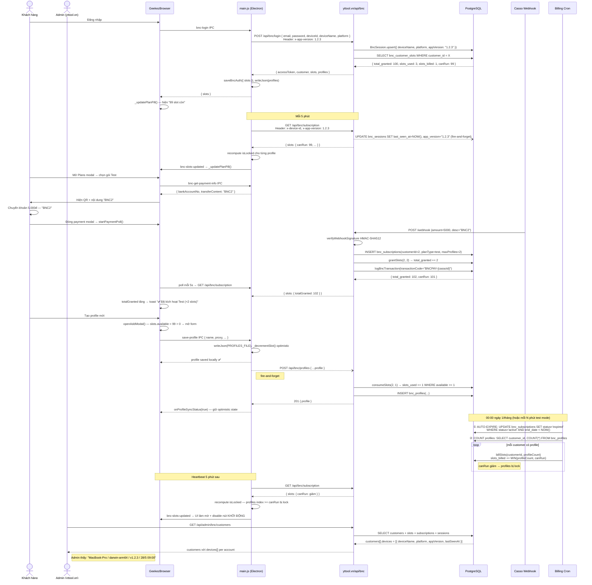
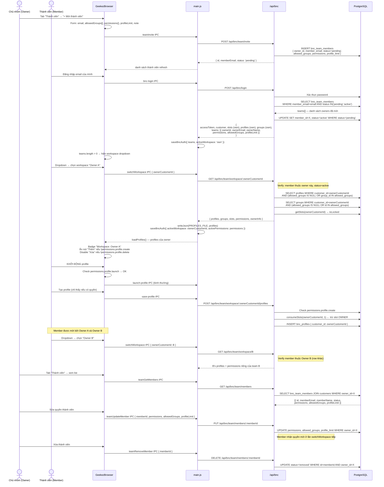

# BNC — Luồng E2E: Mua Gói → Slot → Quản lý Profile

> Cập nhật: 2026-05-28 — Thêm auto-expire subscription, device/version tracking

---

## 1. Cấu hình gói (Plan Catalogue)

Nguồn duy nhất: `server/config/bncPlans.js`

| Gói     | Giá/tháng  | Slots cấp | Max Thiết bị | Loại             |
|---------|------------|-----------|--------------|------------------|
| Starter | 199.000đ   | 30        | **1**        | Single-device    |
| Pro     | 399.000đ   | 100       | **1**        | Single-device    |
| Team    | 699.000đ   | 300       | **3**        | Multi-device     |
| Scale   | 1.299.000đ | 1000      | **5**        | Multi-device     |
| Test    | 5.000đ     | 2         | **2**        | Dev/test only    |

**Mỗi lần mua gói → cộng `maxProfiles` slot vào pool của account (không nhân số tháng).**

**Multi-device hoạt động như thế nào:**
- Server tính `maxDevices = max(maxDevices)` trên **tất cả** sub active của account
- Thiết bị đăng nhập quá giới hạn → thiết bị cũ nhất (trừ thiết bị vừa login) bị kick

---

## 2. Mô hình Slot

```
bnc_customer_slots (1 row per account)
  total_granted  — tổng slot đã mua (cộng dồn, không bao giờ giảm)
  slots_used     — tổng slot đã tiêu (tăng dần, không giảm)
  available      = total_granted - slots_used  (không âm)
```

### 4 sự kiện thay đổi slot

| Sự kiện | Thay đổi | Ghi chú |
|---------|----------|---------|
| **Mua gói** | `total_granted += plan.maxProfiles` | Webhook Casso hoặc Admin tạo thủ công |
| **Tạo profile** | `slots_used += 1` | Atomic `UPDATE ... RETURNING`, block nếu available = 0 |
| **Billing hàng tháng** | `slots_used += MIN(COUNT(profiles), available)` | SQL: `LEAST(slots_used + cnt, total_granted)` |
| **Xóa profile** | Không thay đổi | Slot đã dùng không được hoàn lại |

### 3 Cases đã confirmed

**Case 1 — Mua gói nhưng không tạo profile:**
```
Gói A: 10 slots
Mua → available = 10
Không tạo profile → billing charge 0 (không có profile nào)
Sau 1 tháng, 40 ngày, 1 năm → vẫn còn 10 slots
```

**Case 2 — Tạo profile + billing hàng tháng:**
```
Gói A: 10 slots
Mua → available = 10
Tạo 1 profile → slots_used += 1 → available = 9
Billing tháng 1: charge 1 (1 profile đang chạy) → available = 8
Billing tháng 2: charge 1 → available = 7
... (mỗi tháng -1 nếu không mua thêm)
```

**Case 3 — Hết slot, mua thêm, profiles unlock:**
```
Gói A: 10 slots, tạo 10 profiles → available = 0
→ Tất cả 10 profiles bị LOCK (không dùng được)

Mua gói 2 slots → available = 2
→ 2 profile CŨ NHẤT được unlock
→ 8 profile còn lại vẫn locked

Billing chạy → charge 2 (2 unlocked profiles) → available = 0
→ Tất cả locked lại
```

### Profile locking — isLocked

```
Profiles sort theo clientCreatedAt ASC (profile cũ nhất được ưu tiên giữ slot)

index < available  →  unlocked: dùng bình thường
index >= available →  isLocked = true:
    - UI: mờ 45%, badge 🔒 "Hết slot"
    - Nút KHỞI ĐỘNG: disabled
    - Không thể mở profile cho đến khi mua thêm slot
```

### Billing cycle

- **Production**: Cron chạy lúc `00:00 ngày 1 hàng tháng` (Asia/Ho_Chi_Minh)
- **Test**: Set `BNC_BILLING_INTERVAL_MINUTES=N` trong `server/.env`
- **File**: `server/cron/bncBillingJob.js`

### Auto-expire subscription

Subscription có `end_date < NOW()` nhưng `status = 'active'` → được tự động chuyển về `expired` trước mỗi billing cycle.

- **Trigger**: ngay đầu `runBillingDeduction()`, trước khi charge slot
- **SQL**: `UPDATE bnc_subscriptions SET status='expired' WHERE status='active' AND end_date < NOW()`
- **Tác động tới slot**: Không. Slot đã grant không bị thu hồi khi sub expire.
- **File**: `server/cron/bncBillingJob.js` → `runBillingDeduction()`

### Khi available = 0

| Hành động | Kết quả |
|-----------|---------|
| Tạo profile mới | ❌ Block — server 400 + client guard trước form |
| KHỞI ĐỘNG profile | ❌ Nút disabled hoàn toàn |
| Mua gói | ✅ Unlock profiles ngay sau payment webhook |

---

## 3. Luồng Đăng nhập

```
GeekezBrowser → POST /api/bnc/login
              ← { accessToken, customer, slots: { totalGranted, slotsUsed, available } }

main.js: saveBncAuth({
    accessToken,
    email,
    customerId,
    slots,          // slot pool của account
})
```

- `slots` lưu trong `_bncAuth` (in-memory), hiện trong pill + dropdown avatar
- Heartbeat 5 phút gọi `GET /api/bnc/slots` để refresh slot count

---

## 4. Luồng Mua Gói (Chuyển khoản)

```
1. User mở Plans modal → chọn gói → xem QR thanh toán
2. Nội dung chuyển khoản: "BNC{customerId}" (ví dụ: BNC2)
3. Số tiền = price của gói (ví dụ 5.000đ cho Test)
4. User chuyển khoản → đóng payment modal

5. App tự động poll server mỗi 5 giây (tối đa 3 phút):
   GET /api/bnc/slots
   → so sánh totalGranted với giá trị trước khi mở modal
   → nếu totalGranted tăng → phát hiện thanh toán thành công

6. Casso nhận giao dịch → gọi webhook → yttool.vn/webhook
7. Server xác thực HMAC-SHA512 → processBncPayment():
   - Parse "BNC2" → customerId = 2
   - So khớp amount với plan (±10%) → tìm gói phù hợp
   - months = round(amount / plan.price), tối thiểu 1
   - INSERT bnc_subscriptions (status=active, endDate = now + months*30 ngày)
   - grantSlots(customerId, plan.maxProfiles)  ← cộng slot pool

8. Poll phát hiện totalGranted tăng → toast "✅ Đã kích hoạt gói X"
   - _bncAuth.slots được cập nhật
   - _updatePlanPill() — cập nhật pill + dropdown
   - loadProfiles() reload
```

**Lưu ý:** Nhiều gói active song song là bình thường — mỗi lần mua thêm slot vào pool.

---

## 5. Luồng Tạo Profile

```
User bấm "Thêm profile"
→ openAddModal() kiểm tra slots.available > 0
  → nếu 0 → hỏi "Mua thêm slots?" → openPlansModal()
  → nếu > 0 → mở form

User điền form → bấm Lưu
→ save-profile IPC
→ main.js:
    newProfile = { id: uuidv4(), name, proxy, fingerprint, ... }
    writeJson(PROFILES_FILE)   // lưu local ngay lập tức
    _decrementSlot()           // optimistic UI update

→ bncApiCall('POST', '/profiles', newProfile)  // fire-and-forget sync
→ Server createProfile():
    1. consumeSlots(customerId, 1) [atomic]
       → nếu hết slot → 400 lỗi, onProfileSyncStatus(false) → rollback decrement
    2. INSERT bnc_profiles (customer_id, name, proxy, fingerprint, ...)

Nếu sync thành công: onProfileSyncStatus(true) — giữ optimistic state
Nếu sync fail: onProfileSyncStatus(false) — rollback _bncAuth.slots
```

---

## 6. Luồng Đồng bộ Profile (Manual)

```
Bấm "🔄 Đồng bộ Profile" trong dropdown
→ IPC: bnc-sync-profiles
→ main.js:
    GET /api/bnc/profiles  (trả tất cả profiles của account)
    
    Nếu server có profiles:
        writeJson(PROFILES_FILE, serverProfiles)  // server là source of truth
        → loadProfiles() reload UI
    
    Nếu server không có:
        POST /api/bnc/profiles/bulk { profiles: localProfiles }  // upload local lên
        → consumeSlots(customerId, newProfiles.length) [atomic]
        → nếu hết slot → 409 lỗi

Sau sync: refresh slots từ server → _updatePlanPill()
```

---

## 7. Luồng Sync tự động khi Login

```
bnc-login IPC thành công:
    serverProfiles = result.profiles  // server trả tất cả profiles của account

    Nếu serverProfiles.length > 0:
        writeJson(PROFILES_FILE, serverProfiles)  // dùng server làm master

    Nếu serverProfiles.length === 0:
        localProfiles = readJson(PROFILES_FILE)
        POST /profiles/bulk { profiles: localProfiles }  // upload local lên server
```

---

## 8. Billing Cron — Auto-expire + Slot Deduction

```
Trigger: 00:00 ngày 1 hàng tháng (Asia/Ho_Chi_Minh)
         hoặc mỗi BNC_BILLING_INTERVAL_MINUTES phút (test mode)

runBillingDeduction():
  ① Auto-expire: UPDATE bnc_subscriptions SET status='expired'
                 WHERE status='active' AND end_date < NOW()
     → Subscriptions hết hạn được đánh dấu, slot pool KHÔNG bị thu hồi

  ② Count profiles: SELECT customer_id, COUNT(*) FROM bnc_profiles GROUP BY customer_id

  ③ Với mỗi customer có profile:
     billSlots(customerId, profileCount):
       charge = MIN(profileCount, canRun)    ← canRun = total_granted - slots_billed
       slots_billed += charge                ← atomic UPDATE ... WHERE available >= charge
       → canRun giảm → profiles có index >= canRun bị lock

  ④ App heartbeat 5 phút sau:
     GET /api/bnc/subscription → slots.canRun giảm
     main.js recompute isLocked → push 'bnc-slots-updated' → renderer làm mờ profiles bị lock
```

**Không có gì xảy ra với slot khi:**
- Xóa profile → slots_used giữ nguyên (slot đã tiêu không hoàn)
- Sub expire → total_granted giữ nguyên (slot đã grant không thu hồi)

---

## 9. Multi-device Session Management

```
Login:
    BncSession.upsert({
        customerId, deviceId,
        deviceName: os.hostname(),         ← gửi từ Electron body
        platform: process.platform-arch,   ← e.g. darwin-arm64
        appVersion: x-app-version header,  ← app.getVersion()
    })
    allSessions = findAll ORDER BY last_seen_at ASC
    maxDevices = max(maxDevices across all active subscriptions)

    Nếu allSessions.length > maxDevices:
        kick = sessions[0..N] (cũ nhất, trừ thiết bị vừa login)
        BncSession.destroy(kick)

Heartbeat (mỗi 5 phút — GET /api/bnc/subscription):
    → Server update session: lastSeenAt = NOW(), appVersion = x-app-version (fire-and-forget)
    → 401 reason=other_device/device_kicked → hiện overlay "Đăng nhập máy khác"
    → cập nhật _bncAuth.slots → _updatePlanPill()
```

**Admin xem thiết bị** (`GET /api/admin/bnc/customers`):
```
customers[].devices = [
  { deviceId, deviceName, platform, appVersion, lastSeenAt }
]
```

| Field | Ý nghĩa |
|-------|---------|
| `deviceName` | `os.hostname()` — tên máy |
| `platform` | `darwin-arm64`, `win32-x64`, ... |
| `appVersion` | Version GeekezBrowser (`app.getVersion()`) |
| `lastSeenAt` | Lần cuối heartbeat hoặc login |

---

## 10. Database Schema (liên quan)

```sql
bnc_subscriptions
  id            INTEGER PK AUTOINCREMENT
  customer_id   INTEGER FK → customers.id
  plan_type     ENUM('test','starter','pro','team','scale')
  max_profiles  INTEGER   -- số slot cấp trong lần mua này
  max_devices   INTEGER
  start_date    TIMESTAMP
  end_date      TIMESTAMP
  status        ENUM('active','expired','cancelled')
  price         INTEGER   -- VND tại thời điểm mua
  note          VARCHAR

bnc_customer_slots           -- pool slot cộng dồn của account
  customer_id   INTEGER PK FK → customers.id
  total_granted INTEGER      -- tổng slot đã cấp (cộng dồn)
  slots_used    INTEGER      -- slot tiêu khi tạo profile (không giảm khi xoá)
  slots_billed  INTEGER      -- slot trừ mỗi billing cycle (không giảm tự nhiên)
  created_at    TIMESTAMP
  updated_at    TIMESTAMP
  -- available = total_granted - slots_used  (ngân sách tạo profile mới)
  -- canRun    = total_granted - slots_billed (ngân sách khởi động profile)

bnc_profiles
  id            UUID PK      -- do client tạo
  customer_id   INTEGER FK → customers.id
  name          VARCHAR
  proxy_str     VARCHAR
  fingerprint   JSONB
  group_id      UUID
  is_setup      BOOLEAN
  subscription_id INTEGER FK → bnc_subscriptions.id  (nullable — billing reference)

bnc_sessions                 -- thiết bị đang đăng nhập
  customer_id   INTEGER FK
  device_id     VARCHAR(100)
  device_name   VARCHAR      -- os.hostname()
  platform      VARCHAR      -- darwin-arm64, win32-x64, ...
  app_version   VARCHAR(30)  -- GeekezBrowser version, e.g. 1.2.3
  last_seen_at  TIMESTAMP    -- cập nhật mỗi login + heartbeat
  PRIMARY KEY (customer_id, device_id)
```

---

## 11. Files Chính

| File | Vai trò |
|------|---------|
| `server/config/bncPlans.js` | Nguồn duy nhất cho plan config |
| `server/utils/bncSlots.js` | `getSlots` / `grantSlots` / `consumeSlots` / `billSlots` (atomic) |
| `server/controllers/bncController.js` | Login (lưu session + version), subscription heartbeat, profiles CRUD |
| `server/controllers/bncAdminController.js` | Admin: listCustomers (kèm devices[]), tạo/gia hạn/huỷ gói, version config |
| `server/cron/bncBillingJob.js` | Cron: auto-expire sub + billing slot hàng tháng |
| `server/routes/webhook.js` → `processBncPayment()` | Webhook Casso → tạo sub + grant slots + log transaction |
| `server/models/bncSubscriptionModel.js` | ORM `bnc_subscriptions` |
| `server/models/bncProfileModel.js` | ORM `bnc_profiles` |
| `server/models/bncSessionModel.js` | ORM `bnc_sessions` (multi-device + version tracking) |
| `server/scripts/migrate_bnc_sync.js` | Migration idempotent — tạo/alter tất cả bảng BNC |
| `GeekezBrowser/main.js` | IPC handlers, BNC auth, login/heartbeat gửi `x-app-version`, recompute `isLocked` |
| `GeekezBrowser/renderer.js` | UI: login, slot pill (`canRun`), payment poll, `openAddModal` guard |
| `GeekezBrowser/preload.js` | contextBridge — expose `electronAPI` |
| `GeekezBrowser/index.html` | UI layout, modals, dropdown |
| `dashboard/src/sections/bnc/view/bnc-subscriptions-view.jsx` | Admin UI: customer list, expandable (lịch sử + thiết bị + version) |
| `dashboard/src/sections/bnc/view/bnc-version-view.jsx` | Admin UI: quản lý force/optional update |
| `server/models/bncTeamMemberModel.js` | ORM `bnc_team_members` |
| `server/controllers/bncTeamController.js` | invite / list / update / remove / workspace endpoints |

---

## 12. Sequence Diagram (E2E)



---

## 13. Team Member (Thành viên nhóm)

### Schema `bnc_team_members`

```sql
id             SERIAL PK
owner_id       INTEGER FK → customers.id   -- chủ nhóm (workspace owner)
member_email   VARCHAR(255) NOT NULL        -- email được mời
member_id      INTEGER FK → customers.id NULL  -- điền khi member login lần đầu
status         VARCHAR(20) DEFAULT 'pending'   -- pending | active | removed
allowed_groups JSONB DEFAULT NULL             -- null = tất cả nhóm; [...ids] = lọc
permissions    JSONB NOT NULL DEFAULT '{
  "profile": { "launch":true,  "create":false, "delete":false,
               "editProxy":false, "editFingerprint":false, "editNote":false },
  "group":   { "create":false, "edit":false,   "delete":false }
}'
profile_limit  INTEGER DEFAULT NULL           -- null = không giới hạn
note           VARCHAR(255)
created_at     TIMESTAMP DEFAULT NOW()
updated_at     TIMESTAMP DEFAULT NOW()
UNIQUE (owner_id, member_email)               -- 1 lời mời per owner-member pair
-- member_id có thể xuất hiện nhiều lần (member ở nhiều team)
```

### Luồng Workspace

```
Member có thể thuộc N teams cùng lúc (mỗi owner mời = 1 row riêng).
Khi login → server trả teams[] → client hiện workspace dropdown.
activeWorkspace = 'own' | ownerCustomerId (số).

Khi activeWorkspace = ownerCustomerId:
  - Profiles hiển thị = owner's profiles (filtered by allowedGroups)
  - Slot pill = ẩn (không liên quan đến member)
  - Buttons hiển thị/disable theo permissions{}
  - Tạo profile → tiêu slot của OWNER
  - Xóa/sửa → kiểm tra permissions trên server
```

### Permissions chi tiết

| Permission | Ý nghĩa |
|-----------|---------|
| `profile.launch` | Bấm KHỞI ĐỘNG profile |
| `profile.create` | Tạo profile mới (tiêu slot owner) |
| `profile.delete` | Xóa profile |
| `profile.editProxy` | Sửa proxy của profile |
| `profile.editFingerprint` | Sửa fingerprint |
| `profile.editNote` | Sửa ghi chú |
| `group.create` | Tạo nhóm mới |
| `group.edit` | Đổi tên nhóm |
| `group.delete` | Xóa nhóm |

### API Endpoints

| Method | Path | Auth | Mô tả |
|--------|------|------|-------|
| `POST` | `/api/bnc/team/invite` | owner | Mời member (email, permissions, allowedGroups, profileLimit) |
| `GET` | `/api/bnc/team/members` | owner | Danh sách thành viên |
| `PUT` | `/api/bnc/team/members/:id` | owner | Sửa permissions / allowedGroups / profileLimit |
| `DELETE` | `/api/bnc/team/members/:id` | owner | Xóa member (status→removed) |
| `GET` | `/api/bnc/team/workspace/:ownerCustomerId` | member | Load profiles+groups của owner |
| `POST` | `/api/bnc/team/workspace/:ownerCustomerId/profiles` | member | Tạo profile trong workspace |
| `PUT` | `/api/bnc/team/workspace/:ownerCustomerId/profiles/:id` | member | Sửa profile trong workspace |
| `DELETE` | `/api/bnc/team/workspace/:ownerCustomerId/profiles/:id` | member | Xóa profile trong workspace |

### Sequence Diagram — Team Member


